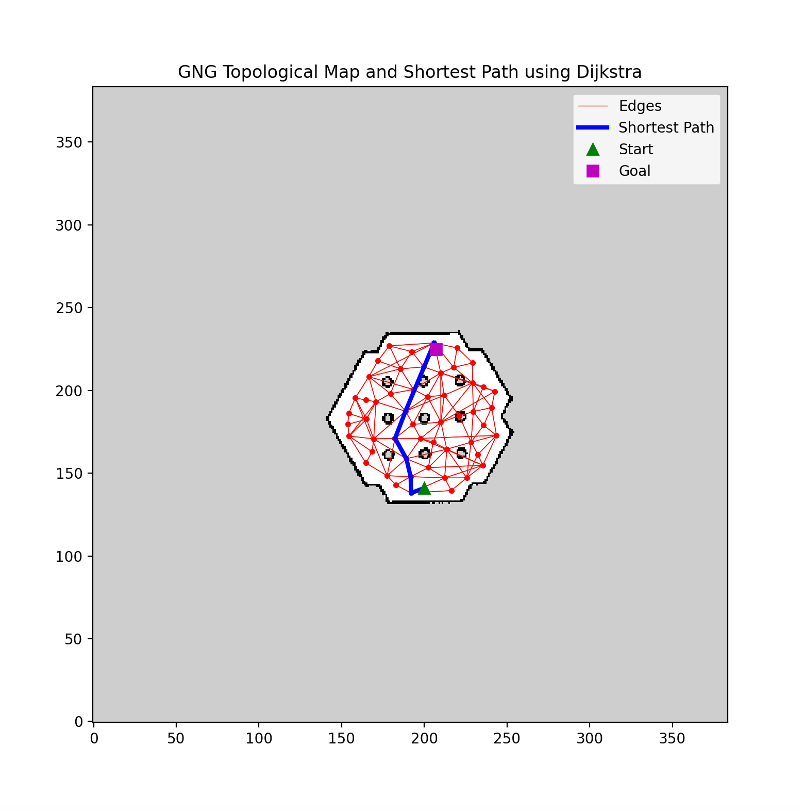

# GNG Topological Mapping with Dijkstra's Shortest Path

This project implements a topological mapping approach using the Growing Neural Gas (GNG) algorithm and Dijkstra's shortest path algorithm. The GNG algorithm is used to generate a topological map from free space detected in a given environment. The Dijkstra algorithm then finds the shortest path from a specified start to a goal position on this map.

## Overview

### Key Features
- **Growing Neural Gas (GNG)**: Creates a topological map of the environment by connecting free space points in a graph structure.
- **Dijkstra's Algorithm**: Computes the shortest path between the start and goal positions on the GNG-generated map.
- **Visualization**: The project includes a visual representation of the generated map, highlighting the edges, shortest path, start, and goal positions.

### Input Files
- **`turtlebot_map.pgm`**: A PGM image file representing the environment map.
- **`turtlebot_map.yaml`**: A YAML file containing metadata about the map (e.g., resolution, origin).

### Output
- **Topological Map Visualization**: A plot that shows the GNG-generated map, edges between nodes, and the shortest path from the start to the goal position.



## Requirements
To run this project, you need the following Python packages:
- `numpy`
- `matplotlib`
- `Pillow`
- `pyyaml`

You can install them using pip:
```bash
pip install numpy matplotlib Pillow pyyaml
```

## Usage

1. **Clone the repository**:
   ```bash
   git clone https://github.com/yani-rl-ai/gng_dijkstra.git
   cd your-repository
   ```

2. **Prepare your environment**:
   Ensure that the `turtlebot_map.pgm` and `turtlebot_map.yaml` files are in the working directory.

3. **Run the script**:
   Execute the script to generate the GNG map and compute the shortest path.
   ```bash
   python standard_gng_pgm_dijkstra_test.py
   ```

4. **View the results**:
   After running the script, a visualization will be generated, showing the GNG topological map and the shortest path.

## Explanation of the Code

- **Loading the Map**: The map is loaded using the Pillow library, and free space is detected by thresholding the PGM image.
- **GNG Algorithm**: The GNG algorithm incrementally builds a graph by connecting nodes (representing free space) based on certain criteria, including edge length and node proximity.
- **Dijkstra's Algorithm**: The shortest path is computed using Dijkstra's algorithm, which considers the distances between nodes in the GNG map.
- **Visualization**: The resulting map and path are plotted using `matplotlib`, with different colors and markers indicating the start, goal, edges, and shortest path.

## Example
The generated visualization shows a GNG topological map with edges (red), the shortest path (blue), start position (green), and goal position (red).

## License
This project is licensed under the MIT License - see the [LICENSE](LICENSE) file for details.


